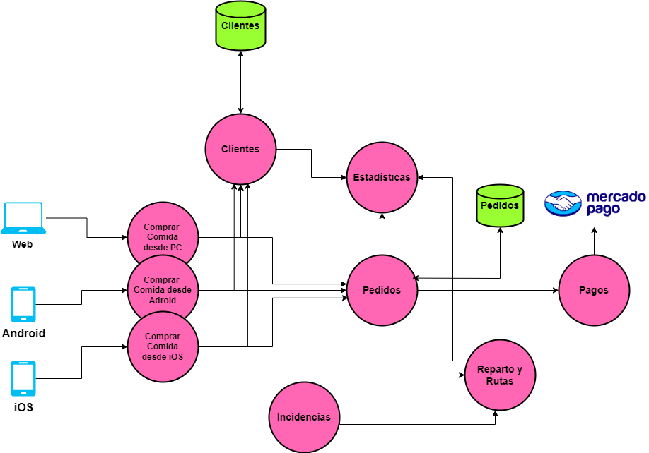
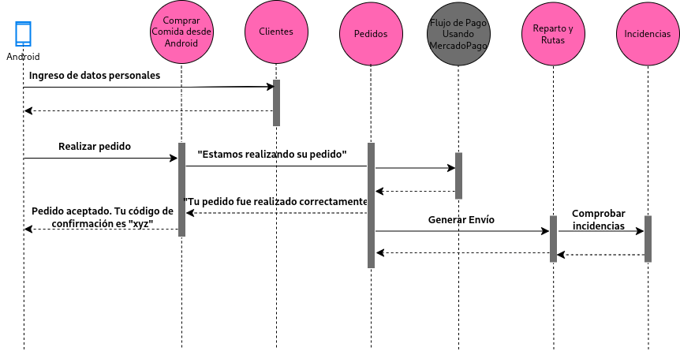

# **Expliación Iteración 1**

## **1. Contexto**
 En esta iteración buscamos sentar las bases para migrar de una arquitectura monolítica a microservicios, comenzando por establecer un plan de migración, definir el protocolo de comunicación entre microservicios e identificar los módulos críticos a priorizar en las proximas iteraciones y durante la migración.

### **ADR 001: [Migración a Microservicios mediante el patrón Strangler.](./ADR001.md)**
- **Problema**: Hay que establecer de que manera vamos a migrar el sistema.
- **Decisión**: Decidimos migrar usando el patrón Strangler porque nos permite realizar una transición controlada y priorizar las funciones más importantes.
- **Impacto**: Mejora la escalabilidad y el rendimiento de servicios clave desde un principio, aunque puede generar problemas al mantener operativos el monolito y los microservicios simultáneamente.

### **ADR 002: [Comunicación entre Microservicios mediante Servicios REST](./ADR002.md)**
- **Problema**: Necesitamos definir cómo se comunicarán los microservicios.
- **Decisión**: Optamos por utilizar servicios REST, más que nada porque es una restricción de la arquitectura.
- **Impacto**: Facilita la independencia de los servicios, pero puede tener ciertos problemas como la latencia asociada a las comunicaciones.

## **2. Diagramas de la iteración**
 Para ver como se comunican los microservicios y como se tendría que ver el sistema una vez migrado, se crearon los siguientes diagramas:

### **Vista inicial microservicios**

### **Diagrama de secuencia cliente**

