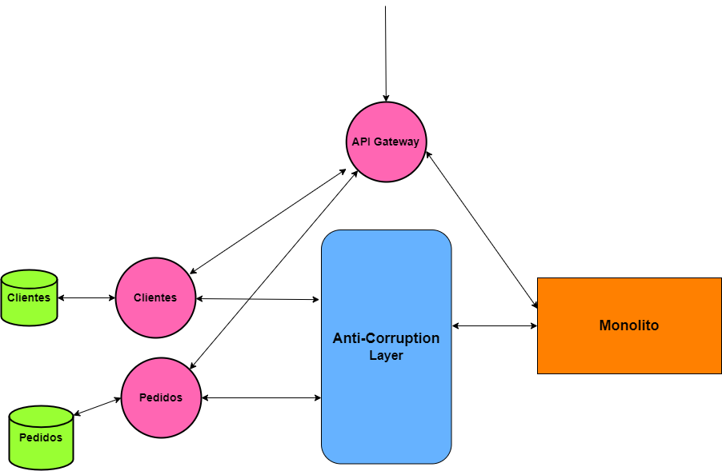
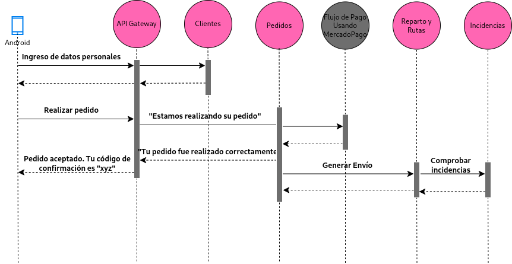

# **Explicación Iteración 2**

## **1. Contexto**
 A partir de la iteración anterior, nos dimos cuenta que había ciertos problemas con la arquitectura.
 - Hay que simplificar el mantenimiento del monolito y los microservicios durante la migración. 
 - Necesitamos una forma de centralizar las solicitudes a los microservicios, ya que había muchos puntos de entrada hacía los mismos.

### **ADR 003: [Anti-Corruption Layer para la transición a microservicios](./ADR003.md)**
- **Problema**: A medida que se migran los servicios, pueden surgir problemas como la corrupción de los microservicios por culpa del monolito.
- **Decisión**: Implementar un Anti-Corruption Layer para abstraer a los microservicios del monolito.
- **Impacto**: Permite que la transición se realice sin comprometer el diseño de los microservicios, pero agrega un overhead en la comunicación entre microservicios y el monolito.

### **ADR 004: [Implementación de API Gateway con servicios REST para la gestión de solicitudes](./ADR004.md)**
 - **Problema**: Múltiples puntos de entradas para las solicitudes de los usuarios/clientes.
 - **Decisión**: Implementar un API Gateway.
 - **Impacto**: Mejora la escalabilidad y centraliza la gestión de solicitudes, aunque introduce un punto único de fallo que debería eliminarse.

## **2. Diagramas de la iteración**
### **Snapshot sistema con dos servicios migrados**

### **Diagrama de secuencia cliente actualizado**

