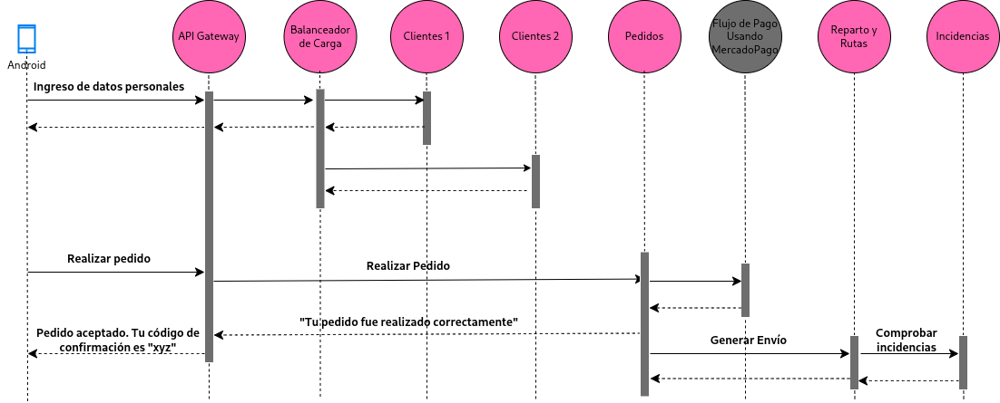

# **Explicación Iteración 3**

## **1. Contexto**
Una vez que le dimos las bases al sistema, empezamos a atacar ciertos atributos de calidad relacionados a la escalabilidad y performance. Para esto, decidimos replicar instancias y agregar un balanceador de carga para distribuir las solicitudes entrantes cuando sea necesario.

### **ADR 005: [Replicar instancias y Balanceador de Carga](./ADR005.md)**
- **Problema**: Mantener funcionamiento normal del sistema incluso bajo alta demanda.
- **Decisión**: Generar replicas de las instancias y manejar las solicitudes a las mismas mediante un balanceador de carga
- **Impacto**: Mejora la escalabilidad y la performance del sistema, pero requiere configuración y mantenimiento adicional.

## **2. Diagramas de la iteración**
### **Subsistema con balanceador de carga**
.png)

### **Diagrama de secuencia cliente actualizado**

