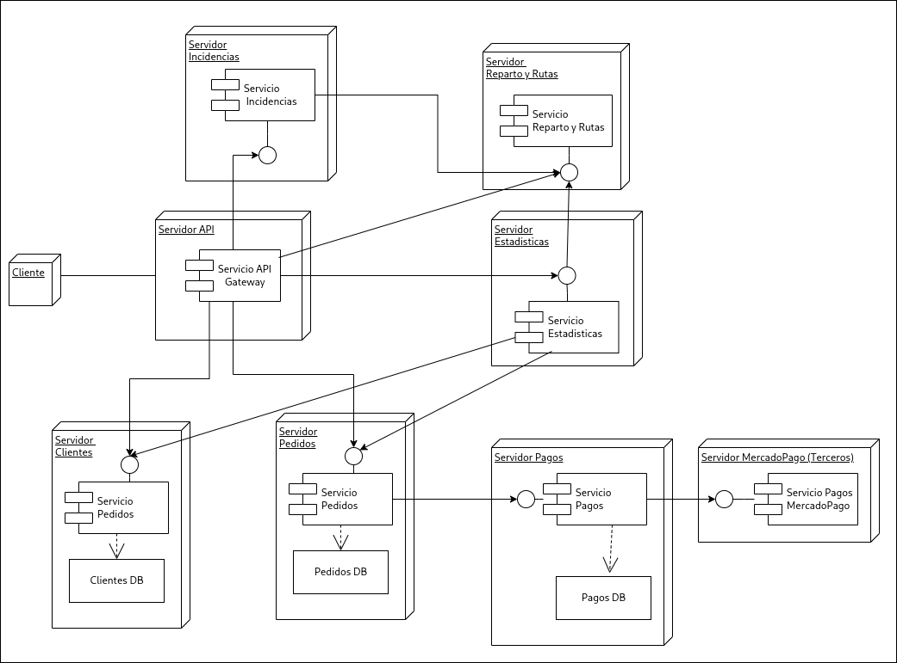

# **Expliación Iteración 4**

## **1. Contexto**
En esta iteración decidimos seguir anvanzando sobre otros atributos de calidad, pero en este caso enfocandonos en las bases de datos. Decidimos descomponer la base de datos de Clientes dos bases (Pagos y Clientes), y utilizar el patrón Database per Service para terminar de independizar las bases de datos.

### **ADR 006: [Descomposición de la base de datos Clientes](./ADR006.md)**
- **Problema**: La base de datos Clientes contiene información personal de los clientes y datos relacionados con pagos, lo que dificulta la escalabilidad de los servicios.
- **Decisión**: Descomponer la base de datos "Clientes" en dos bases independientes (Pagos y Clientes) para facilitar el escalado independiente de las funcionalidades de Clientes y Pagos.
- **Impacto**: Se consigue una separación clara de responsabilidades entre servicios. Introduce inconsistencias y problemas de sincronización de datos.

### **ADR 007: [Uso del Database per Service para la separacion de de la Base de datos Clientes](./ADR007.md)**
- **Problema**: Es necesario elegir un patrón que permita implementar bases de datos separadas por dominio, manteniendo la independencia entre servicios.
- **Decisión**: Descomponer la base de datos en dos bases de datos independientes utilizando el patrón Database per Service.
- **Impacto**: Permite que los servicios ajusten su base de datos a las necesidades específicas de cada dominio, como Clientes o Pagos. Aumenta la complejidad en la gestión de múltiples bases de datos.

## **2. Diagramas de la iteración**
### **Subsitema con las bases de datos por separado**
.png)

### **Diagrama de deployment del sistema**

