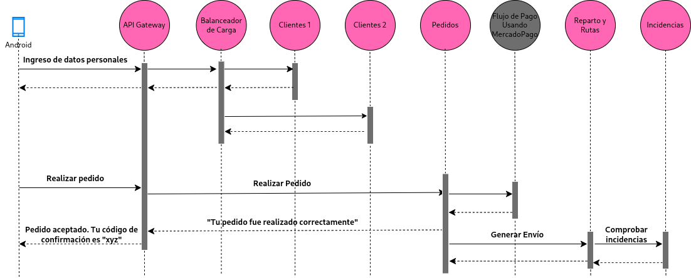

# Documentación de Iteraciones

## [Iteración 1: Planteo Microservicios y Migración](../decisions/iteracion_1/Explicacion.md)

## [Iteración 2: Simplificar la Migración con API Gateway y ACL](../decisions/iteracion_2/Explicacion.md)

## [Iteración 3: Mejora de Escalabilidad y Performance mediante Balanceo de Carga](../decisions/iteracion_3/Explicacion.md)

## [Iteración 4: Cambios en las Bases de Datos](../decisions/iteracion_4/Explicacion.md)

# Diagramas finales #
## Componentes

## Arquitectura final

## Diagrama de secuencia final

